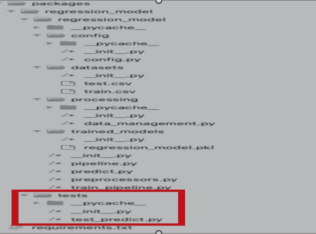
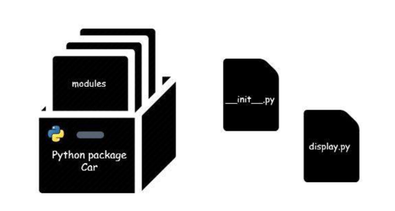

# Introduction et mise en contexte du projet de synthése :
* Dans le cadre d3 notre cours(420-A61-SF PRÉPARATION DE LA SOLUTION D'IA POUR LA MISE EN PRODUCTION groupe 12020
), nous notre mandat réside de la mise en place la structure de compilation et de création des
modèles de manière automatique, en utilisant GitHub, CircleCI (CI- CD) et GemFury(un utilitaire de
publication pour la mise en production)
* Le travail consiste donc à créer un modèle en python, avec ses propres tests unitaires et de faire en sorte
que lorsqu’un nouveau changement est envoyé vers GitHub, un processus récupère ce code, le compile
et crée automatiquement un nouvel artefact, qui sera hébergé chez GemFury
* Le modèle utilise un jeu de données Kaggle appelé « House Prices - Advanced Regression Techniques
» et qui sert à prédire le prix des maisons, basé sur leur caractéristique propre et le marché

### Partie 1 : organiser le code en pipelines et entraîner le modèle
Les répertoires sont restructurés comme dans l'image ci-dessous

Ceci n'est qu'une partie du code qui utilise trois fichiers principaux : pipeline.py, preprocessors.py et train__pipeline.py. En dehors de cela, train.csv et test.csv sont stockés dans le dossier /packages/regression_model/datasets
Chaque dossier doit avoir un fichier __init__.py

### Partie 2 : Créer un package Python à partir d'un modèle Machie Learning :

* Il s'agit de la deuxième partie qu'on splite sur plusieurs parties sur la création et le déploiement d'un modèle d'apprentissage automatique - création et installation d'un package python à partir de votre modèle prédictif en Python.

