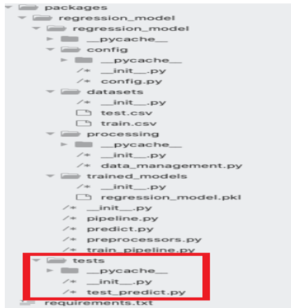
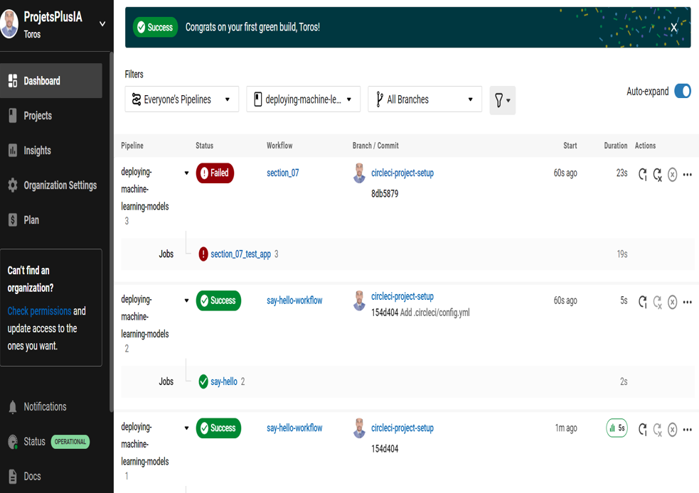

# A. Mise en contexte du projet de synthése :
* Dans le cadre dr notre cours(420-A61-SF PRÉPARATION DE LA SOLUTION D'IA POUR LA MISE EN PRODUCTION groupe 12020
), nous notre mandat réside de la mise en place la structure de compilation et de création des
modèles de manière automatique, en utilisant GitHub, CircleCI (CI- CD) et GemFury(un utilitaire de
publication pour la mise en production)
* Le travail consiste donc à créer un modèle en python, avec ses propres tests unitaires et de faire en sorte
que lorsqu’un nouveau changement est envoyé vers GitHub, un processus récupère ce code, le compile
et crée automatiquement un nouvel artefact, qui sera hébergé chez GemFury
* Le modèle utilise un jeu de données Kaggle appelé « House Prices - Advanced Regression Techniques
» et qui sert à prédire le prix des maisons, basé sur leur caractéristique propre et le marché

### B. Partie 1 : organiser le code en pipelines et entraîner le modèle
Les répertoires sont restructurés comme dans l'image ci-dessous



Ceci n'est qu'une partie du code qui utilise trois fichiers principaux : pipeline.py, preprocessors.py et train__pipeline.py. En dehors de cela, train.csv et test.csv sont stockés dans le dossier /packages/regression_model/datasets
Chaque dossier doit avoir un fichier __init__.py

### C. Partie 2 : Création un package Python à partir d'un modèle Machie Learning :

* Il s'agit de la deuxième partie qu'on splite sur plusieurs parties sur la création et le déploiement d'un modèle d'apprentissage automatique - création et installation d'un package python à partir de votre modèle prédictif en Python.


#### NB
Ainsi, pour  s’assurer que l’exécution du code de test test_predict.py qui contient le code pour tester notre modèle avec toutes les fonctionnalisées qu’on a bâti, il ne faut pas oublier de mettre à jour notre fichier de requirement.txt par l’ajout de librairie de test (pytest avec la bonne version)
 ```
* Trained_model : emplacement pour enregistrer les modèles dans le fichier .pkl
* Pipeline.py : Construire un pipeline avec toutes les opérations

* Preprocessors.py : Toutes les fonctions d'ajustement et de transformation utilisées dans le pipeline Train_pipeline.py : Exécuter le modèle et enregistrer les modèles

* Requirements.txt : tous les packages nécessaires avec les versions à installer

* Pip install -r requirements.txt doit être exécuté une fois on ait denvant un ajout d'une nouvelle package ou une Lib.
* MANIFEST.in : fournit des détails sur les fichiers à conserver dans le package.
* Setup.py : Autres détails sur le modèle, les métadonnées, les exigences, les informations de licence et d'autres détails
 ```
 ### exigences de déploiement et mise en production
 ```
      numpy==1.15.4 scikit-learn==0.20.2 pandas==0.23.4
      setuptools==40.6.3
  ```
 ### exigences de test de validation des différantes fonctionnaliées
 ```
      pytest>=4.6.6,<5.0.0
```
## Fonctionnement :
* Sortie (résultat d’entrainement du modèle) : 
Un nouveau fichier regression_model.pkl est généré dans le dossier packages/regression_model/trained_models

### D. Partie 3 :Configuration et publication du modèle en intégration continue sur CircleCI et  Gemfury
* #### Configuration avec le jeton et le nom utilisateur (Token et username):
* Il s'assurer d'abord de la création des comptes sur CircleCI et Gemfury:
* #### CiccleCI:
```

    - Gnération Token
    - Génération Username
```
* #### Gemfury:
```
    - PIP_EXTRA_INDEX_URL= https :// insérer_ici_ton_jeton_générer_via_Gemfury@pypi.fury.io/insérer_ici_your_username_de_Github
```


* #### Capture d'écran illustrant le succès des tâches :


 


